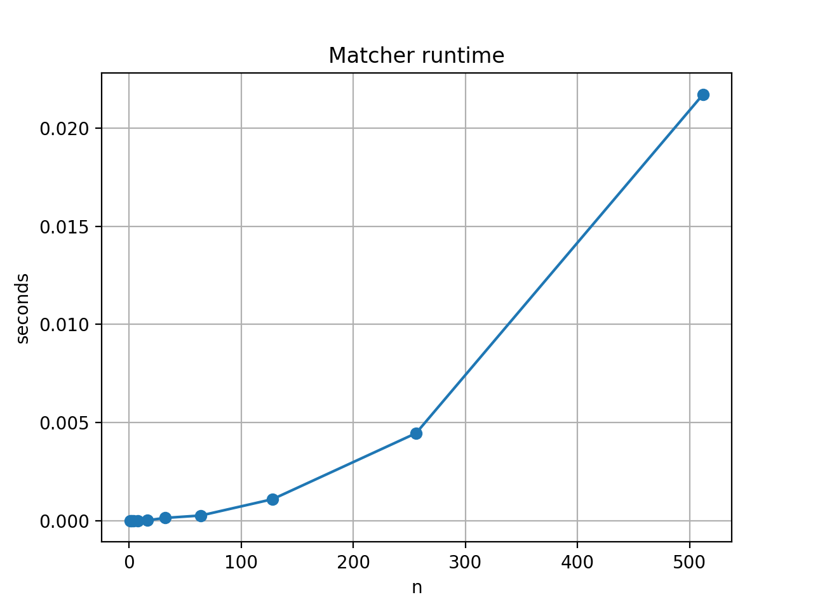
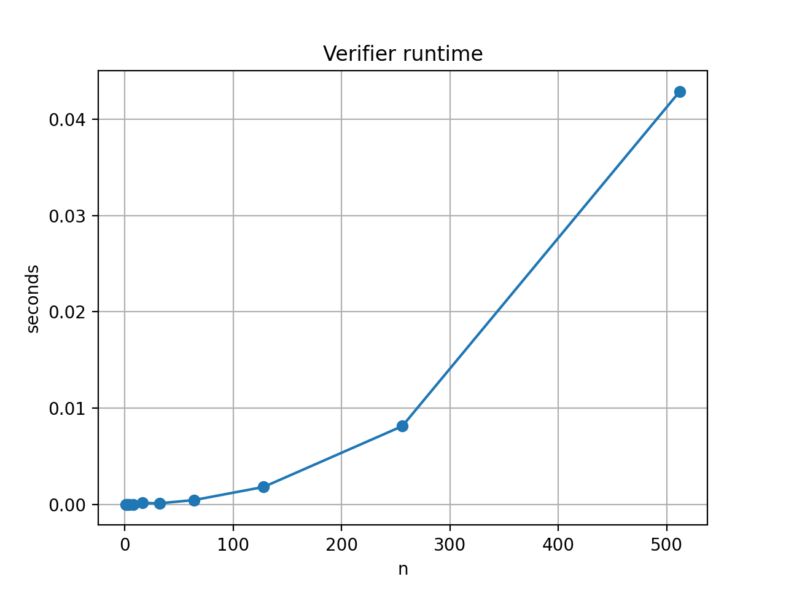

# Algorithm Abstraction Programming Assignment 1: Stable Matching

## Authors
*   **Name**: Stephen Davis
*   **UFID**: 63144483
*   **Name**: Sebastian Robalino
*   **UFID**: 84159795

## Compilation and Build Instructions
This project is implemented in Python 3. No compilation is required.
You must have Python 3 installed.
The benchmarking mode (Task C) requires `matplotlib`.

To install dependencies:
```bash
pip install matplotlib
```

## Run Instructions

### Matcher (Task A)
To run the Gale-Shapley matching algorithm:
```bash
python src/gale-shapely.py [input_file] [output_file]
```

**Example:**
```bash
python src/gale-shapely.py data/example.in data/output.txt
```
This reads preferences from `data/example.in` and writes the matching to `data/output.txt`.

### Verifier (Task B)
To run the validity and stability verifier:
```bash
python src/verifier.py [input_file] [matching_file]
```

**Example:**
```bash
python src/verifier.py data/example.in data/output.txt
```
This checks if the matching in `data/output.txt` is valid and stable for the instance in `data/example.in`.

Output will be `VALID STABLE` or an error message explaining why it is invalid or unstable.

## Assumptions
*   Input files follow the format specified in the assignment (n lines of hospital prefs, n lines of student prefs).
*   Structure of input is strictly integers separated by whitespace.
*   Libraries: Standard Python libraries (`sys`, `time`, `random`, `collections`) are used for core logic. `matplotlib` is used only for generating graphs.
*   The system has Python 3 installed.

## Task C: Scalability
We measured the running time of the matching engine and the verifier on n = 1, 2, 4, ..., 512.

### Analysis & Trend
The Gale-Shapley algorithm theoretically runs in O(n^2). As shown in the graph below, the runtime increases quadratically as n increases. The verifier also exhibits polynomial growth as it must check for blocking pairs.

### Runtime Graphs
**Matcher Runtime:**


**Verifier Runtime:**

